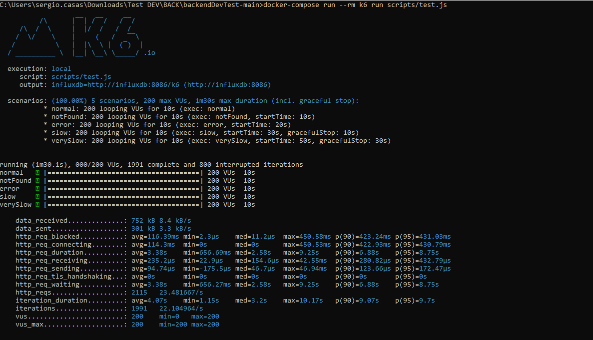

# # Backend dev technical test

This aplication is a Spring Boot aplication that serve the main rest API in http://localhost:5001/swagger-ui.html

## Requirements

For building and running the application you need:

- JDK 1.11
- Maven 3


## Running the application in Docker

```shell
docker build -t test-mca .

docker run -dp 3000:3000 test-mca
```

## Running the application locally

```shell
mvnw spring-boot:run
```

## Running the test

```shell
mvnw test
```

## Results K6

The results of the k6 test environment

